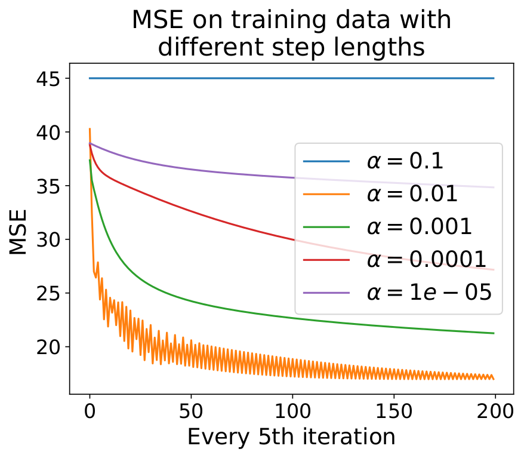
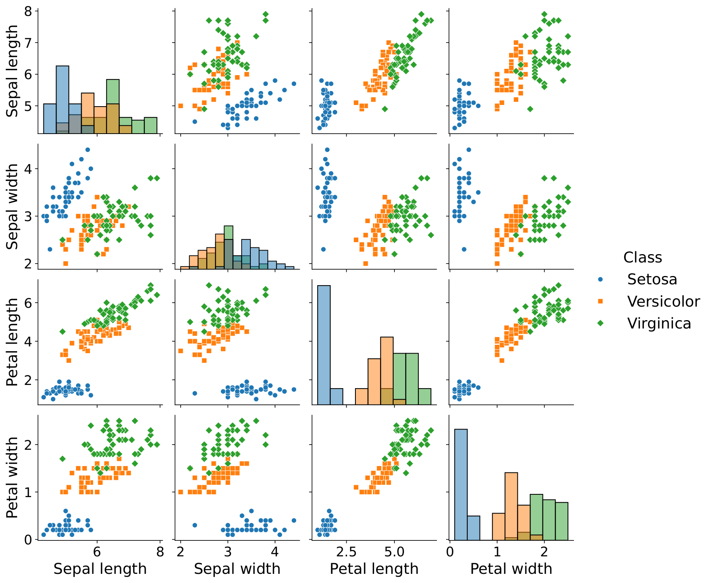
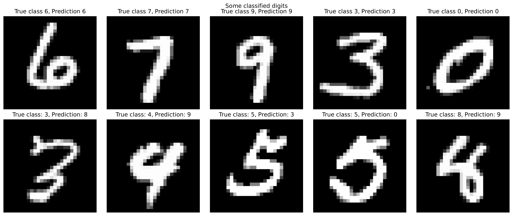
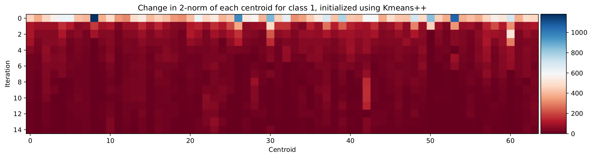



## TTK4235 — Embedded Systems (2024)

**Single elevator controller in C**

Implement a working elevator controller for a physical single-elevator rig in C, designed from UML diagrams which were produced before the code.

### Architecture

The controller is event-driven. A state machine handles the elevator's top-level behaviour across four modes: **idle** (stationary at a floor, no pending requests), **moving** (travelling up or down toward the next request), **door open** (serving a floor, on a 3-second timer before closing), and **emergency stop** (triggered by the stop button or a sustained obstruction). Transitions between states are driven by sensor events, floor sensors, button presses, the obstruction switch, and the stop button.

Pending floor requests are stored in a **doubly-linked list queue**. It is well to note that this is by far not the most optimal approach by any reasonable metric, and the linked list data structure was chosen in order to maximize learning. The data in each node of the linked list is a `Request` struct holding a floor number, a direction, and an `off` flag indicating whether someone is exiting at that floor:

```c
typedef struct Request {
    struct Request *pNextRequest;
    struct Request *pPrevRequest;
    int floor;
    ButtonType direction;
    bool off;
} Request;

typedef struct Queue {
    Request *head;
    Request *tail;
    int numberOfNodes;
} Queue;
```

The queue uses sentinels; both head and tail, which in turn simplify edge-case handling by making sure that any insertion never has to handle special-cases. New requests are inserted in sorted order using `Where_To_Attach_Request`, which walks the list from the current position and decides whether to attach before or after each node based on the elevator's current floor, direction of travel, and the requested floor. The result is that requests are serviced in the order the elevator naturally encounters them rather than in arrival order, meaning no unnecessary reversals.

The full design was documented in UML before implementation as part of the learning outcome of the course. Class diagrams for module interfaces (Queue, Motor, Buttons, SensorData, ButtonHandler, Door), state diagrams for the elevator lifecycle, and sequence diagrams for key scenarios including door obstruction and power loss mid-travel.

## TTT4275 — Estimation, Detection & Classification (2025)

**Linear classifiers and nearest-neighbor methods from scratch in Python**

Two classification problems: the Iris dataset (3 classes, 4 features) and MNIST handwritten digits (10 classes, 784 features). No library classifiers utilizing gradient descent, KNN, and K-means all implemented from scratch in NumPy.

### Linear Classifier on Iris

A linear classifier $g(x) = Wx + w_0$ where each of the 3 classes gets its own discriminant function (row of $W$). At inference, the class with the highest output wins. The model is trained with **gradient descent** on the MSE loss between the sigmoid-activated outputs and one-hot targets:

$$
\mathcal{L} = \frac{1}{N} \sum_{i=1}^N \left\| \sigma(Wx_i + w_0) - t_i \right\|^2
$$

The gradient with respect to $W$:

$$
\nabla_W \mathcal{L} = \frac{1}{N} \sum_{i=1}^N \left( g(x_i) - t_i \right) x_i^\top
$$

Applying the sigmoid $\sigma(z) = \frac{1}{1+e^{-z}}$ before computing the MSE softens the gradient near decision boundaries. Without it, outputs far from the boundary produce large gradients and training diverges early. The sigmoid makes the loss landscape more tractable.

Step length $\alpha$ had to be tuned carefully. We swept from $10^{-4}$ to $10^{-1}$ and plotted MSE vs iteration count. Below a threshold, the gradient steps were so small that convergence took thousands of iterations with diminishing returns; above it, the loss oscillated and never settled. The usable range was a roughly one order of magnitude window around $10^{-2}$.


<!-- Extract from TTT4275_rapport.pdf, page 8, Figure 4: MSE vs iterations plot for several α values, showing the trade-off between convergence speed and stability -->


<!-- Extract from TTT4275_rapport.pdf, page 7, Figure 3: scatter plot matrix of all pairwise feature combinations for the 3 Iris classes, illustrating the Versicolor/Virginica overlap -->

**Results:** 93–97% accuracy on the test set depending on train/test split. Setosa was classified perfectly in every run — it is linearly separable from the other two in almost any feature pair. Versicolor and Virginica overlap significantly in all four features; the confusion matrices show that almost all misclassifications happen on that boundary. A linear classifier cannot fully separate them regardless of how well it is trained.

### KNN + K-Means on MNIST

**1-NN** classification on 28×28 flattened images: for each test image, compute Euclidean distance to all 60,000 training images and assign the label of the nearest neighbor. This achieved **96.9% accuracy** on the MNIST test set with no learned representation — raw pixel distance carries a surprising amount of class information for digit images.

The cost is quadratic in training set size at inference: 60,000 distance computations per query. To make this tractable, the training set was compressed using **K-means clustering** — each class's examples are replaced by $K$ cluster centroids:

$$
\mu_k = \frac{1}{|C_k|} \sum_{x \in C_k} x
$$

Centroids were initialized with K-means++ (choosing each new center proportional to its squared distance from the nearest existing center) rather than random initialization, which improved cluster quality and convergence speed. The final centroids are visually interpretable: at $K = 64$, each digit class has 64 prototype images that together span the variation in writing style for that digit — thick strokes, thin strokes, different slants.

With $K = 64$ centroids per class (640 total prototypes vs. 60,000 training images), accuracy dropped to **94.2%** — a 2.7 percentage point loss in exchange for a **240× speedup** at inference. The accuracy-vs-$K$ curve had a clear structure: below $K = 32$, centroids were too coarse to represent within-class variation and accuracy dropped sharply; above $K = 128$, additional centroids added marginal improvement at increasing memory cost.

The most confused digit pair was 9 and 4, consistent across all $K$ values and classifier variants. Visually, ambiguous 9s have a closed loop with a vertical stroke that closely resembles certain 4 styles — the confusion is in the pixel geometry, not in the classifier.




