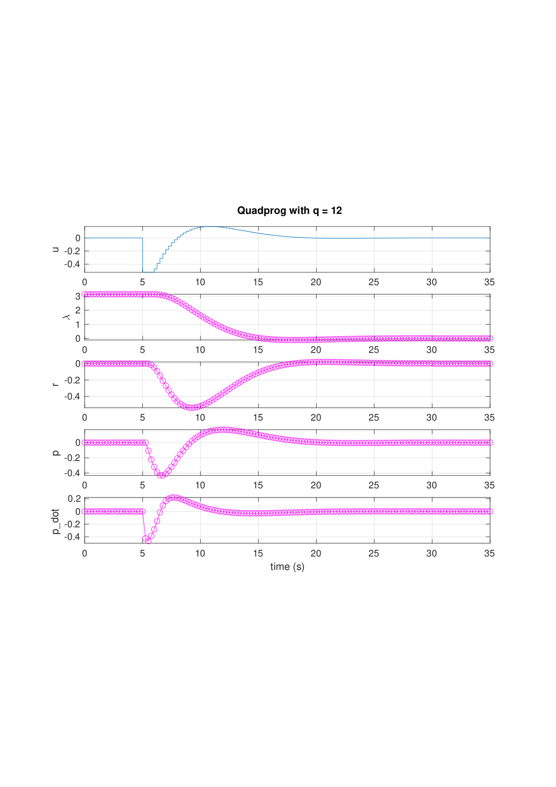
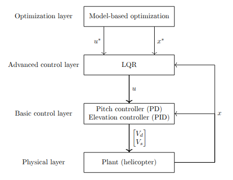
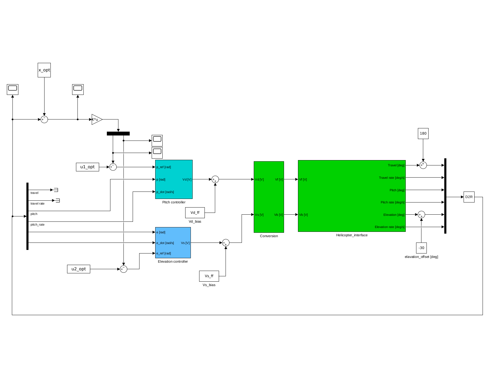
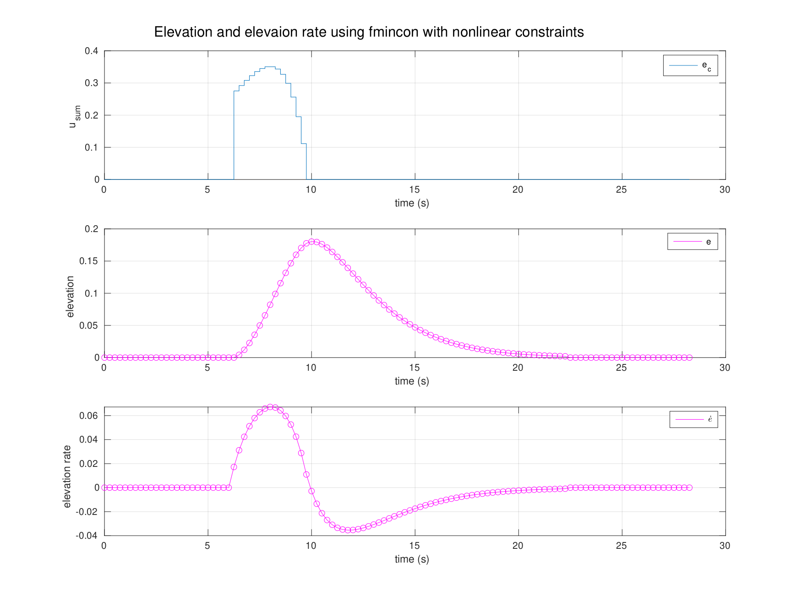



Both courses use the same physical rig — two rotors, three encoders, one IMU, bolted to a table. TTK4115 focuses on stabilization and state estimation; TTK4135 on computing and tracking optimal trajectories. The plant is a coupled 3-DOF system with travel $\lambda$, pitch $p$, and elevation $e$ as states. All designs are based on linearized models around hover.

## TTK4115 — Linear System Theory (2024)

Four labs, each building on the previous.

### Part 1 — Monovariable PD (Pole Placement)

The first lab isolated the travel axis. In the linearized model, travel acceleration is proportional to pitch angle:

$$
\ddot{\lambda} = K_{pp} \, p
$$

A PD controller was used to drive the travel error to zero, with pitch as the effective input. The gains were computed analytically: specify two desired closed-loop poles, expand the characteristic polynomial, match coefficients. The transfer function from pitch setpoint to travel gives a second-order closed-loop system, so placing both poles determines $K_p$ and $K_d$ uniquely.

### Part 2 — Multivariable LQR

The second lab replaced the single-axis PD with a full-state LQR covering travel, pitch, and elevation simultaneously. The LQR minimizes:

$$
J = \int_0^\infty \left( x^\top Q x + u^\top R u \right) dt
$$

The optimal gain matrix $K$ is found by solving the continuous-time algebraic Riccati equation (CARE):

$$
A^\top P + PA - PBR^{-1}B^\top P + Q = 0 \qquad K = R^{-1}B^\top P
$$

The matrices $Q$ and $R$ are design parameters. $Q$ penalizes state error meaning large diagonal entries on a state mean the controller works hard to keep it near zero. $R$ penalizes input magnitude, so a large $R$ produces conservative, energy-efficient inputs at the cost of slower tracking.

We ran experiments at both extremes. High $Q$, low $R$: tracking was tight and the step responses looked good, but the inputs were saturating frequently and the rig vibrated noticeably. Low $Q$, high $R$: the rig barely responded to reference changes, taking several seconds to reach setpoints. Final tuning balanced both tracking setpoints cleanly within a reasonable time without saturating the actuators. The coupling between axes that was visible in Part 1 was now handled directly by the multivariable structure.

### Part 3 — Luenberger Observer

The rig does not give full state measurements. The IMU provides angular velocity directly; angles (pitch, elevation) come from encoders, which are noisy at low speeds; travel rate is differentiated from encoder counts. Feeding these raw signals directly into the LQR produces noisy control inputs that cause motor chatter.

The solution is a **Luenberger observer** which is essentially a parallel model of the plant driven by the same inputs as the original. Together the luenberger observer and the original system can run in tandem with the goal of minimizing the estimation error:

$$
\dot{\hat{x}} = A\hat{x} + Bu + L(y - C\hat{x})
$$

The observer gain $L$ is chosen to place the observer poles faster than the controller poles, so the state estimate converges before the controller acts on it. This is the separation principle: controller and observer can be designed independently and combined without stability loss.

The key design decision is which states to include in the observer model. If the observer state vector is smaller than the actual plant state, for example omitting a coupling term, then the innovation term $L(y - C\hat{x})$ is trying to correct an incomplete model. The estimation error grows unbounded because the missing dynamics can't be compensated by a fixed gain. This showed up clearly in the experimental data: a minimal state observer had estimation error growing to order $10^3$, while the full-state observer tracked the true states cleanly.

### Part 4 — Kalman Filter

The Luenberger observer uses a fixed gain $L$ designed for nominal conditions. It works well in steady-state but doesn't adapt when noise levels change. The **Kalman filter** replaces the fixed gain with one that is optimal given the current noise covariances.

The filter models process noise $Q_w$ (uncertainty in the plant model) and measurement noise $R_v$ (sensor noise). At each timestep it runs two steps:

**Prediction:** propagate the state estimate forward using the dynamics model.

**Update:** correct the prediction using the new measurement, weighted by how much you trust the measurement relative to the model:

$$
K = P C^\top (C P C^\top + R_v)^{-1}
$$

The Kalman gain $K$ is recomputed (or precomputed offline for a time-invariant system by solving the discrete Riccati equation) so that the correction is small when $R_v$ is large (noisy sensors -> lean more on the model) and large when $P$ is large (uncertain model -> lean more on the measurement).

Under larger disturbances where the model diverged from reality, the Kalman filter consistently outperformed the Luenberger observer, and the adaptive weighting absorbed disturbances the fixed-gain observer amplified into the control signal. The state estimates were smoother, and the resulting control inputs were less noisy.

## TTK4135 — Optimization & Control (2025)

Same rig, different objective. Rather than stabilizing around a fixed setpoint, the goal is to find an **optimal input sequence** that drives the helicopter from one configuration to another while minimizing a cost, subject to actuator constraints. The four labs increase in complexity from a pure open-loop QP to a nonlinear constrained problem.

### Part 1 — Open-Loop QP

The objective is to find the input sequence $\mathbf{u} = [u_0, \ldots, u_{N-1}]^\top$ that minimizes a quadratic cost over a finite horizon while respecting actuator limits:

$$
\min_{\mathbf{u}} \; \frac{1}{2} \mathbf{u}^\top G \mathbf{u} + c^\top \mathbf{u} \qquad \text{s.t.} \quad u_{\min} \mathbf{1} \le \mathbf{u} \le u_{\max} \mathbf{1}
$$

The matrices $G$ and $c$ are assembled analytically by rolling out the linearized dynamics $N$ steps. Defining the prediction model as:

$$
\mathbf{x} = A_d x_0 + B_d \mathbf{u}
$$

and substituting into the quadratic cost in $x$ and $u$, the result is a standard QP in $\mathbf{u}$ alone. $G$ is positive definite by construction, so the problem is strictly convex and has a unique global minimum. The assembled matrices were passed to MATLAB's `quadprog`.

The cost weight $q$ (on state deviation) was varied across three values: $q = 0.12$, $1.2$, $12$. Low $q$ penalizes state error lightly. The optimizer in turn finds a slow, fuel-efficient trajectory that reaches the target gradually. High $q$ penalizes deviation heavily and the trajectory reaches the target quickly but demands much larger inputs. The actuator constraints were active (hit the bound) in the high-$q$ case, showing that the optimizer was pushing as hard as physically allowed.

### Part 2 — LQR Feedback on Optimal Trajectory

An open-loop trajectory computed offline is fragile. Any disturbance or model mismatch causes the real system to deviate from the planned path, and the open-loop sequence has no mechanism to correct it and errors accumulate over the horizon.

The fix is to add a feedback layer. The precomputed trajectory gives a nominal state sequence $x^*_k$ and input sequence $u^*_k$. An LQR regulator is designed to reject deviations from this reference by working in deviation coordinates $\delta x = x - x^*$, $\delta u = u - u^*$:

$$
\delta u_k = -K \, \delta x_k \qquad u_k = u^*_k + \delta u_k
$$

The LQR gain $K$ is computed on the same linearized model as the trajectory. The result is a two-layer structure: the trajectory planner sets the nominal path offline, and the LQR stabilizer runs online to absorb disturbances. In practice the rig tracked the reference significantly better with feedback active, because, without it, the helicopter drifted noticeably within a few seconds of the maneuver starting.

<!-- Extract from Helicopter_Lab_Report.pdf, page 9, Figure 5: 4-layer block diagram of the hierarchical control structure with trajectory planner feeding LQR -->

<!-- Extract from Helicopter_Lab_Report.pdf, page 12, Figure 8: Simulink scope captures of LQR states during the final testing round -->

### Part 3 — MPC Formulation

Model Predictive Control generalizes the approach from Part 2 by solving the optimization problem **online at every timestep**, using the current measured state as the initial condition. The horizon shifts forward by one step each time and only the first control input is applied, then the problem is re-solved with fresh measurements.

$$
\min_{u_0, \ldots, u_{N-1}} \sum_{k=0}^{N-1} \left( x_k^\top Q x_k + u_k^\top R u_k \right) + x_N^\top P x_N
$$

The terminal cost $x_N^\top P x_N$ is typically chosen as the LQR cost-to-go (the solution to the infinite-horizon LQR), which gives a stability guarantee for the closed-loop MPC under mild conditions.

The key advantage over the open-loop + LQR structure is that MPC re-plans at every step based on the actual current state, so it corrects for disturbances and model error automatically through the optimization rather than through a separate feedback law. Constraints on inputs and states are handled directly inside the QP therefore there's no separate saturation logic.

The computational cost scales with horizon length $N$: longer horizons give better performance and stability margins but require solving a larger QP. For this lab, the solver ran comfortably within the 10ms sample interval across all tested horizon lengths.

### Part 4 — Nonlinear SQP with Elevation Constraint

The final lab adds a hard constraint: the helicopter's elevation $e(t)$ must remain above a threshold $e_{\min}$ for all $t$ in the maneuver. This represents terrain avoidance or a clearance requirement:

$$
e_k \ge e_{\min} \qquad \forall \, k \in \{0, \ldots, N\}
$$

Since $e_k$ is a nonlinear function of the inputs through the plant dynamics, this constraint is nonlinear in $\mathbf{u}$. The problem is no longer convex, and `quadprog` cannot handle it. The course-prescribed solver is MATLAB's `fmincon`, which solves the nonlinear program using Sequential Quadratic Programming (SQP) internally.

SQP works by linearizing the constraints at the current iterate and solving the resulting local QP to get a search direction, then taking a step along that direction (with a line search) and repeating. It converges to a local minimum satisfying the KKT conditions. For this problem, with a single inequality constraint on elevation, convergence was consistent and the resulting trajectory arced over the elevation floor rather than cutting through. the optimizer found that the least-cost path respecting the constraint was to climb, complete the travel maneuver at altitude, then descend.

<!-- Extract from Helicopter_Lab_Report.pdf, page 18, Figure 11: 5-panel fmincon/SQP optimal trajectory clearly showing the elevation constraint being respected — the helicopter arcs over the floor -->
