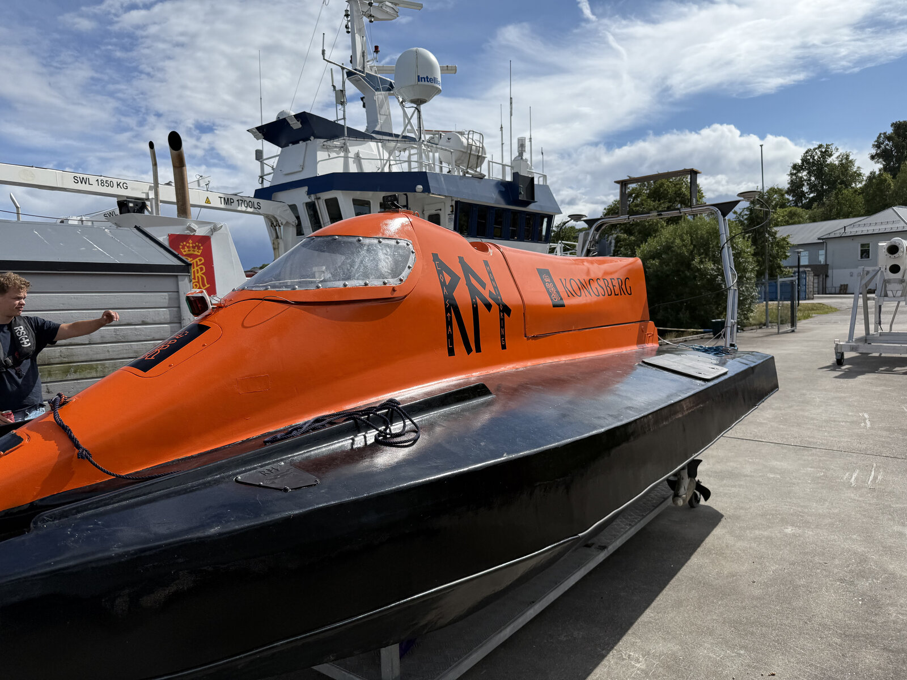
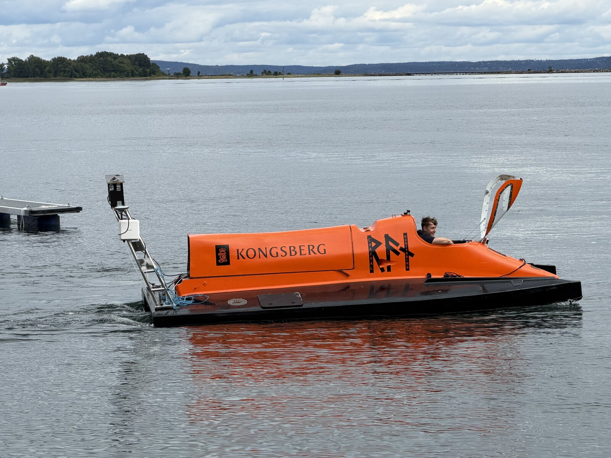
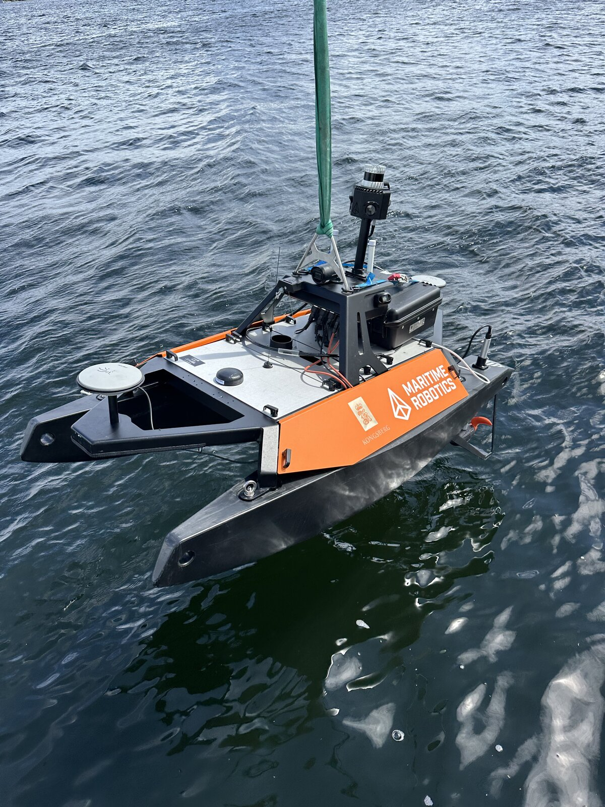

<pre style="font-size: 0.45em; line-height: 1.2; letter-spacing: 0.05em; overflow-x: auto; text-align: center;">
███████╗██╗  ██╗██████╗ ███████╗██████╗ ██╗███████╗███╗   ██╗ ██████╗███████╗
██╔════╝╚██╗██╔╝██╔══██╗██╔════╝██╔══██╗██║██╔════╝████╗  ██║██╔════╝██╔════╝
█████╗   ╚███╔╝ ██████╔╝█████╗  ██████╔╝██║█████╗  ██╔██╗ ██║██║     █████╗  
██╔══╝   ██╔██╗ ██╔═══╝ ██╔══╝  ██╔══██╗██║██╔══╝  ██║╚██╗██║██║     ██╔══╝  
███████╗██╔╝ ██╗██║     ███████╗██║  ██║██║███████╗██║ ╚████║╚██████╗███████╗
╚══════╝╚═╝  ╚═╝╚═╝     ╚══════╝╚═╝  ╚═╝╚═╝╚══════╝╚═╝  ╚═══╝ ╚═════╝╚══════╝
</pre>

Where the code stops being a simulation and starts being a boat.

---

## Kongsberg Discovery

**Summer Intern, Coastal Monitoring / USV Swarm** · Summer 2026

Worked on the Coastal Monitoring project, built around **Ran**, our main autonomous
surface vessel (USV), together with **Gudrun**, a Maritime Robotics Otter. Two boats
is not much of a swarm yet, and that was the point: a proof of concept for swarm
operation that scales up to many more vessels later, rather than a finished fleet.

- **Autonomy with MOOS-IvP.** Learned MOOS from scratch and used the IvP Helm for
  autonomous operation of the vessels, so a mission could be handed to the boats
  rather than driven by hand.
- **Networking over WiFi and Tailscale.** Set up the vessel-to-shore and
  vessel-to-vessel links over WiFi, with Tailscale configured so everything talks
  securely over the VPN rather than over an open network.
- **Azimuth thruster modification.** Changed both the firmware and the electronics
  on the azimuth thrusters to unlock their rotation from ±90° to ±180°, giving the
  boat a much larger usable thrust envelope.
- **Mechanical work and field work.** Paint job, detailing and general prep on Ran,
  plus being out on the water for the trials. A surprising amount of an autonomy
  summer is spent in an orange survival suit.
- Learned that the gap between "works in simulation" and "works in a fjord with
  wind, waves and a flaky link" is where most of the engineering actually is.

**Tech:** MOOS-IvP, Python, C, embedded Linux, WiFi networking, Tailscale

---

## Nordic Semiconductor

**Summer Intern** · Jun 2025 to Aug 2025 · Trondheim
**Software Engineer, part-time** · Sep 2025 to Dec 2025 · Trondheim

Embedded software in the **Short Range Radio** team, working on Bluetooth Low Energy.
Started as a summer intern and stayed on part-time through the autumn, in the space
where BLE meets real hardware: small, testable firmware in C, and scripting away the
repetitive bits.

- **BLE components in C.** Built Bluetooth Low Energy software components for
  embedded targets on nRF and Zephyr, from advertising and connection flows up to
  GATT-level features.
- **Zephyr RTOS, hands-on.** Configuring, building, flashing and debugging firmware
  on real Nordic boards until it behaves outside the lab too.
- **BabbleSim.** Simulated wireless environments to study how BLE behaves under
  interference before taking anything to hardware.
- **Scripting and automation.** Shell and lightweight scripting to streamline
  development, automation and testing, so experiments came out repeatable and fast.

**Tech:** C, Zephyr RTOS, nRF SoCs, Bluetooth Low Energy, BabbleSim, shell scripting
