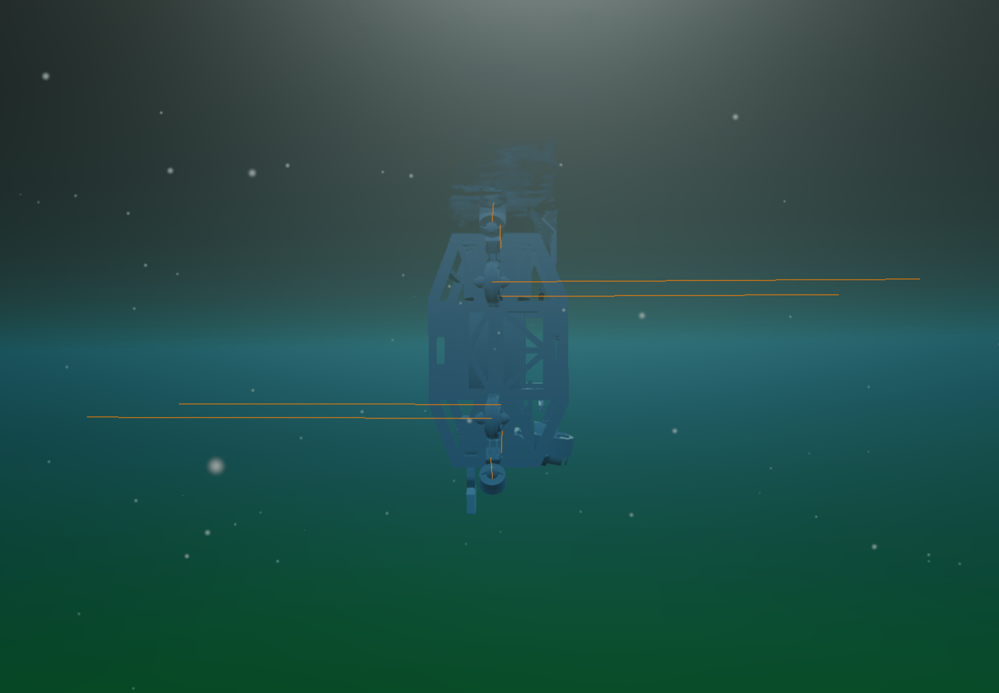



<pre style="font-size: 0.45em; line-height: 1.2; letter-spacing: 0.05em; overflow-x: auto; text-align: center;">
 ██████╗ ██╗   ██╗ █████╗ ████████╗███████╗██████╗ ███╗   ██╗██╗ ██████╗ ███╗   ██╗    ██████╗ ██████╗ 
██╔═══██╗██║   ██║██╔══██╗╚══██╔══╝██╔════╝██╔══██╗████╗  ██║██║██╔═══██╗████╗  ██║    ██╔══██╗██╔══██╗
██║   ██║██║   ██║███████║   ██║   █████╗  ██████╔╝██╔██╗ ██║██║██║   ██║██╔██╗ ██║    ██║  ██║██████╔╝
██║▄▄ ██║██║   ██║██╔══██║   ██║   ██╔══╝  ██╔══██╗██║╚██╗██║██║██║   ██║██║╚██╗██║    ██║  ██║██╔═══╝ 
╚██████╔╝╚██████╔╝██║  ██║   ██║   ███████╗██║  ██║██║ ╚████║██║╚██████╔╝██║ ╚████║    ██████╔╝██║     
 ╚══▀▀═╝  ╚═════╝ ╚═╝  ╚═╝   ╚═╝   ╚══════╝╚═╝  ╚═╝╚═╝  ╚═══╝╚═╝ ╚═════╝ ╚═╝  ╚═══╝    ╚═════╝ ╚═╝     
                                                                                                       
</pre>

Avoids gimbal lock, has superior numerical stability to euler angles, and utilizes error state formulation to avoid 4x3 noninvertible transformation matrix.

---

## Overview

This is an **adaptive backstepping** controller used for dynamic positioning (DP) of an AUV in 6DOFs. The core idea is to replace the standard Euler angle kinematics with a **quaternion error-state formulation**, which eliminates gimbal lock and gives a kinematic Jacobian that is invertible everywhere except at a full 180° error. Which when utilizing SSA is a  scenario that simply doesn't occur in practice.
The controller was implemented in ROS2 as part of [Vortex NTNU's](https://www.vortexntnu.no/) AUV stack.

---

## Conventions

The proof uses the notation below. Note that in the actual implemented code, the names differ from the mathematical derivation:

| Math | Code | Meaning |
|---|---|---|
| $J_e(\eta)$ | `L` | Error-state kinematic Jacobian $\in \mathbb{R}^{6 \times 6}$ |
| $T_e(q_e)$ | `Q` | Quaternion-to-angular-velocity transformation matrix |

All other notation follows Fossen (2021). The unit quaternion is written $q = \begin{bmatrix} \eta \\ \varepsilon \end{bmatrix}$ with $\eta \in \mathbb{R}$, $\varepsilon \in \mathbb{R}^3$, and $\|q\|^2 = 1$.

---

## AUV Dynamics

The AUV is governed by two coupled differential equations.

1. The **kinematic equation** maps body-frame velocities to NED-frame velocities and angular rates:

$$\dot{\eta} = J_q(\eta)\nu \tag{A}$$

2. The **dynamic equation** (Newton-Euler in body frame):

$$M\dot{\nu} + C(\nu)\nu + D(\nu)\nu + g(\eta) + g_0 = \tau + \tau_{\text{dist}} \tag{B}$$

where the full state is $\eta = \begin{bmatrix} p^n \\ q^n \end{bmatrix}$ with $p^n = [x_n, y_n, z_n]^\top$ the NED pose, and $\nu = \begin{bmatrix} v_{nb}^b \\ \omega_{nb}^b \end{bmatrix}$ the body-frame linear and angular velocities.

The standard quaternion kinematic matrix is:

$$J_q(\eta) = \begin{bmatrix} R(q_b^n) & 0 \\ 0 & T(q_b^n) \end{bmatrix}$$

where $R(q_b^n) \in SO(3)$ is the rotation matrix from NED to body, and $T(q_b^n)$ is derived using the quaternion derivative identity:

$$\dot{q} = \frac{1}{2}\begin{bmatrix} -\varepsilon^\top \\ \eta I_3 + S(\varepsilon) \end{bmatrix} \omega_{nb}^b = \frac{1}{2} q_b^n \otimes \begin{bmatrix} 0 \\ \omega_{nb}^b \end{bmatrix}$$

The problem: $J_q(\eta) \in \mathbb{R}^{7 \times 6}$ is non-square and therefore not invertible, and in our case, utilizing backstepping, we will later require the inverse of J.

Key assumptions for the DP problem,

A.1) The AUV is essentially neutrally buoyant s.t the terms $g(\eta) + g_0$ are negligable

A.2) $M = M^\top > 0$, $\dot{M} = 0$ as stated in Fossen 2021, §12.1

A.3) The damping is parameterised as $D(\nu)\nu = -Y(\nu)\Theta^\star$, where $Y(\nu) \in \mathbb{R}^{6 \times 12}$ is a known velocity-dependent regressor and $\Theta^\star \in \mathbb{R}^{12}$ are the unknown damping coefficients. 

A.4) The desired pose is/ or will eventually be constant s.t $\dot{\eta_d} = 0$

With these, (B) reduces to (B*) below. 

---

## Error-State Quaternion Formulation

Instead of working with $\eta$ directly, we define the **quaternion error**:

$$\delta q = q_d^* \otimes q = \begin{bmatrix} \eta_e \\ \varepsilon_e \end{bmatrix}$$

where $q^* = q^{-1}$ for unit quaternions, $\eta_e \in \mathbb{R}$ is the scalar part, and $\varepsilon_e \in \mathbb{R}^3$ is the vector part. Note: $\eta_e$ here is the quaternion scalar and not the pose vector $\eta$. This is to match Fossen's standard overloading of the symbol. 

The identity quaternion is $q_I = \begin{bmatrix} 1 \\ 0_{3\times 1} \end{bmatrix}$, s.t

$$
\begin{align*}
\delta q &\to q_I \quad \text{as} \quad q \to q_d \\
\eta_e &\to 1, \quad \varepsilon_e \to 0
\end{align*}
$$

From the angle-axis representation we have, $q = \begin{bmatrix} \cos(\theta/2) \\ \hat{n}\sin(\theta/2) \end{bmatrix}$

Here the vector part of the error quaternion satisfies $\varepsilon_e = \hat{n}\sin(\theta_e/2)$.

And using the small angle approximation we can approximate $\varepsilon_e \approx \tfrac{1}{2}\hat{n}\theta_e$, so $2\varepsilon_e \approx \hat{n}\theta_e$ directly recovers the rotation vector. We therefore take:

$$e_q = 2\varepsilon_e \in \mathbb{R}^3$$

as the orientation error state. This gives a $6$-dimensional error vector $z_1$ and a square Jacobian.

We can also see this kinematically: defining $T_e(q_e) = \eta_e I_3 + S(\varepsilon_e)$ and differentiating $\delta q = q_d^* \otimes q$:

$$\dot{\varepsilon}_e = \tfrac{1}{2} T_e(q_e)\,\omega_{nb}^b \quad \Rightarrow \quad \dot{e}_q = T_e(q_e)\,\omega_{nb}^b$$

The factor of 2 in $e_q$ will cancel out $\tfrac{1}{2}$ from $\dot{e}_q$ which makes it a clean linear map from $\omega_{nb}^b$ that backstepping can invert directly.

and equations (A) and (B) become:

$$
\begin{align}
\dot{\eta} &= J_e(\eta)\nu \tag{A*} \\
M\dot{\nu} + C(\nu)\nu - Y(\nu)\Theta^\star &= \tau + \tau_d^\star \tag{B*}
\end{align}
$$

with the **error-state Jacobian**:

$$J_e(\eta) = \begin{bmatrix} R(q_b^n) & 0 \\ 0 & T_e(q_e) \end{bmatrix} \in \mathbb{R}^{6 \times 6}$$

$J_e$ is smooth, differentiable, and **invertible for $|\delta\theta| < 180°$**. Which are exactly the conditions that backstepping requires. Moreover the change from a singularity at |90°| pitch to non-invertibility at |180°| error in attitude is in practice an upgrade due to a stable DP controller implemented with SSA should never realistically recieve such extreme commands. 

> We chose $\delta q = q_d^* \otimes q$ rather than $q \otimes q_d^*$, because local perturbations expressed in the body frame are more intuitive for control purposes.

---

## The Backstepping Design

### Step 1, Position & Attitude Error

Define the tracking error in $\mathbb{R}^6$ using the error-state representation:

$$z_1 \doteq \begin{bmatrix} p - p_d \\ e_q \end{bmatrix} = \begin{bmatrix} p - p_d \\ 2\varepsilon_e \end{bmatrix}$$

where $\delta q = q_d^* \otimes q = \begin{bmatrix}\eta_e \\ \varepsilon_e\end{bmatrix}$, and $z_1 \to 0$ as $(p, q) \to (p_d, q_d)$.

Recall A.4: $\dot{\eta}_d = 0$, which is a standard assumption for the DP problem.

Propose the Lyapunov candidate function:

$$V_1 = \frac{1}{2} z_1^\top z_1 > 0, \quad V_1(0) = 0$$

which is positive definite and radially unbounded. Since $\dot{z}_1 = J_e(\eta)\nu$ from (A*):

$$\dot{V}_1 = z_1^\top \dot{z}_1 = z_1^\top J_e(\eta)\nu$$

Following the backstepping procedure (Khalil §14.3), treat $\nu$ as a virtual input and split it as $\nu = \alpha + z_2$ with $z_2 = \nu - \alpha$:

$$\dot{V}_1 = z_1^\top J_e(\eta)(\alpha + z_2) = z_1^\top J_e \alpha + \underbrace{z_1^\top J_e z_2}_{\text{cross term}}$$

Choose the virtual control law:

$$\alpha = -J_e(\eta)^{-1} K_1 z_1, \quad K_1 = K_1^\top > 0$$

so that $z_1^\top J_e \alpha = -z_1^\top K_1 z_1 < 0$. This gives:

$$\boxed{\dot{V}_1 = -z_1^\top K_1 z_1 + z_1^\top J_e z_2}$$

### Step 2, Velocity Error

A very common LCF for robotic systems is,

$$V_2 = \frac{1}{2} z_2^\top M z_2$$

Where we recall A.2: $M = M^\top > 0$, $\dot{M} = 0$ as stated in Fossen 2021, §12.1

Differentiating and substituting (B*) yields,

$$\dot{V}_2 = z_2^\top M(\dot{\nu} - \dot{\alpha}) = z_2^\top\bigl(\tau - C(\nu)\nu + Y(\nu)\Theta^\star + \tau_d^\star - M\dot{\alpha}\bigr)$$

Now we need to think about Cross-term cancellation.

Note that $z_1^\top J_e z_2$ (from Step 1) is a scalar, so $z_1^\top J_e z_2 = z_2^\top J_e^\top z_1$. If the control law contains $-J_e^\top z_1$, then the compound LFC $V_c = V_1 + V_2$ yields:

$$\dot{V}_c \ni z_1^\top J_e z_2 + z_2^\top(-J_e^\top z_1) = z_2^\top J_e^\top z_1 - z_2^\top J_e^\top z_1 = 0$$

The cross terms cancel exactly, independent of the structure of $J_e$. If all parameters were known, choosing:

$$\tau_{\text{nom}} = -J_e^\top z_1 - K_2 z_2 + M\dot{\alpha} + C(\nu)\nu - Y(\nu)\Theta^\star - \tau_d^\star$$

yields $\dot{V}_c = -z_1^\top K_1 z_1 - z_2^\top K_2 z_2 < 0$, which is a strict Lyapunov candidate function.

However, since $\Theta^\star$ and $\tau_d^\star$ are unknown, we attempt to cancel them out using an MRAC style direct estimation procedure.

### Adaptive Extension

Since $\Theta^\star$ and $\tau_d^\star$ are unknown, introduce two additional LCFs for the parameter errors, where $\tilde{\Theta} = \hat{\Theta} - \Theta^\star$ and $\tilde{\tau}_d = \hat{\tau}_d - \tau_d^\star$:

$$V_\Theta = \frac{1}{2}\tilde{\Theta}^\top \Gamma_\theta^{-1} \tilde{\Theta}, \qquad V_d = \frac{1}{2}\tilde{\tau}_d^\top \Gamma_d^{-1} \tilde{\tau}_d$$

where $\Gamma_\theta, \Gamma_d > 0$ are diagonal adaptation gain matrices. Under A.3 ($\Theta^\star$ and $\tau_d^\star$ constant), $\dot{\tilde{\Theta}} = \dot{\hat{\Theta}}$ and $\dot{\tilde{\tau}}_d = \dot{\hat{\tau}}_d$, so:

$$\dot{V}_\Theta = \tilde{\Theta}^\top \Gamma_\theta^{-1} \dot{\hat{\Theta}}, \qquad \dot{V}_d = \tilde{\tau}_d^\top \Gamma_d^{-1} \dot{\hat{\tau}}_d$$

The compound LCF is then:

$$V = V_1 + V_2 + V_\Theta + V_d$$

Substituting the control law (to be derived):

$$\tau = -J_e^\top z_1 - K_2 z_2 + M\dot{\alpha} + C(\nu)\nu - Y(\nu)\hat{\Theta} - \hat{\tau}_d$$

into $\dot{V} = \dot{V}_1 + \dot{V}_2 + \dot{V}_\Theta + \dot{V}_d$ and collecting all terms (cross terms cancel, $C(\nu)\nu$ and $M\dot\alpha$ cancel):

$$
\begin{aligned}
\dot{V} &= -z_1^\top K_1 z_1 - z_2^\top K_2 z_2 \\
&\quad + \tilde{\Theta}^\top\!\left(\Gamma_\theta^{-1}\dot{\hat{\Theta}} - Y(\nu)^\top z_2\right) \\
&\quad + \tilde{\tau}_d^\top\!\left(\Gamma_d^{-1}\dot{\hat{\tau}}_d - z_2\right)
\end{aligned}
$$

Zeroing the two bracketed terms gives the **update laws**:

$$\dot{\hat{\Theta}} = \Gamma_\theta\, Y(\nu)^\top z_2, \qquad \dot{\hat{\tau}}_d = \Gamma_d\, z_2$$

### Final Control Law

$$
\boxed{\tau = -J_e^\top z_1 - K_2 z_2 + M\dot{\alpha} + C(\nu)\nu - Y(\nu)\hat{\Theta} - \hat{\tau}_d}
$$

which gives:

$$\dot{V} = -z_1^\top K_1 z_1 - z_2^\top K_2 z_2 < 0, \quad \forall\,(z_1, z_2) \neq 0 \quad \blacksquare$$

Global asymptotic stability of $z_1 = 0$, $z_2 = 0$ follows from LaSalle's invariance principle (Khalil §4.2) applied to the compact sub-level sets of $V$, with parameter estimates remaining bounded due to the adaptive law structure.

### Computing $\dot{\alpha}$

Usually the tricky part with backstepping control laws, which many authors refer to as the explosion of dimentionality is calculating the derivative of your virtual control law.

$$\alpha = -J_e(\eta)^{-1} K_1 z_1$$

To get the derivative we can apply the matrix derivative identity $\tfrac{d}{dt}(A^{-1}) = -A^{-1}\dot{A}A^{-1}$.

$$\dot{\alpha} = J_e^{-1}\dot{J}_e J_e^{-1} K_1 z_1 - J_e^{-1} K_1 J_e \nu$$

The second term is immediate. The first requires $\dot{J}_e$, which involves:

$$\dot{R}(q^n) = R(q^n) S(\omega_{nb}^b), \qquad \dot{T}_e = \dot{\eta}_e I_3 + S(\dot{\varepsilon}_e)$$

where $\dot{\eta}_e$ and $\dot{\varepsilon}_e$ come from differentiating $\delta q = q_d^* \otimes q$:

$$\dot{q}_e = \begin{bmatrix} \dot{\eta}_e \\ \dot{\varepsilon}_e \end{bmatrix} = \frac{1}{2} q_e \otimes \begin{bmatrix} 0 \\ \omega \end{bmatrix} = \frac{1}{2}\begin{bmatrix} -\varepsilon_e^\top \omega \\ (\eta_e I_3 + S(\varepsilon_e))\omega \end{bmatrix}$$

Substituting back gives the compact block expression for $\dot{J}_e$:

$$\dot{J}_e = \begin{bmatrix} R\,S(\omega) & 0 \\ 0 & \tfrac{1}{2}\bigl(S(T_e \omega) - (\varepsilon_e^\top \omega) I_3\bigr) \end{bmatrix}$$

Unlike the Euler-angle $\dot{T}$ (a lengthy trigonometric expression), the quaternion $\dot{T}_e$ has a compact closed form because the quaternion kinematic equation is bilinear. The $T_e$ parameterisation was designed to make this tractable.

---

## No Gimbal Lock at 90° Pitch

Euler-angle-based controllers lose a degree of freedom at ±90° pitch (gimbal lock). The quaternion error-state formulation has no such singularity and $J_e$ remains full rank for all $|\delta\theta| < 180°$.

Below: the AUV commanded to hold 90° pitch in simulation, and the corresponding tracking data.

---

## Links

- [Source code (ROS2)](https://github.com/vortexntnu/vortex-auv/tree/main/control/dp_adapt_backs_controller_quat)
- [Vortex NTNU](https://www.vortexntnu.no/)

## Sources

1. T. I. Fossen, *Handbook of Marine Craft Hydrodynamics and Motion Control*, 2nd ed. Hoboken, NJ: Wiley, 2021. ISBN 978-1-119-57510-7.
   + Unit-quaternion kinematics and error quaternion (Ch. 2)
   + Marine craft dynamics and the mass/Coriolis decomposition (Ch. 3)
   + Backstepping control for DP (Ch. 12).

2. H. K. Khalil, *Nonlinear Systems*, 3rd ed. Upper Saddle River, NJ: Prentice Hall, 2002. ISBN 978-0-13-067389-3.
   + Lyapunov stability analysis of nonlinear systems (Ch. 4)
   + Barbalat's lemma for adaptive systems (§8.4).
   + Backstepping design for strict-feedback systems (§14.3)
