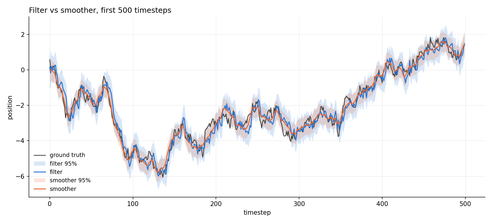
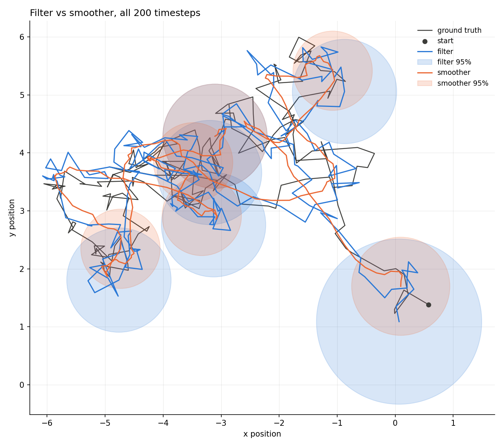
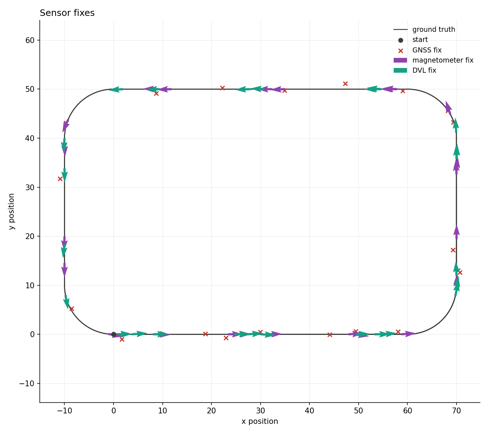
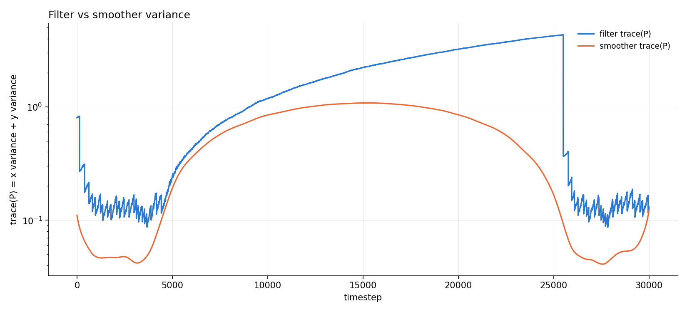
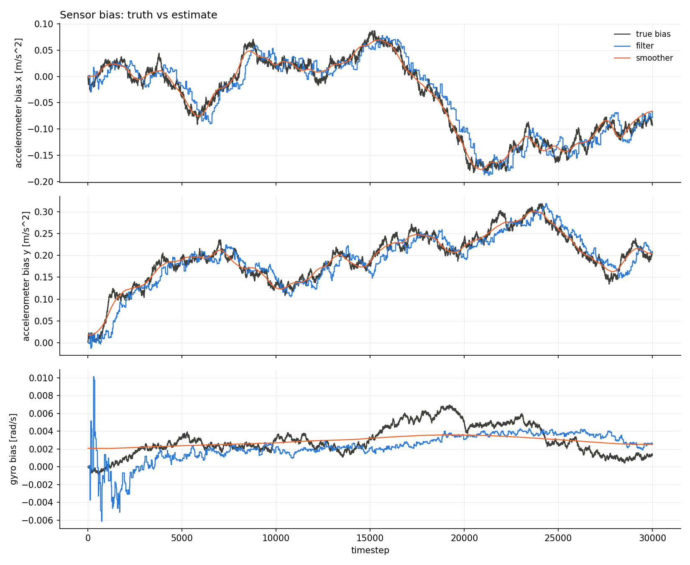



<pre style="font-size: 0.45em; line-height: 1.2; letter-spacing: 0.05em; overflow-x: auto; text-align: center;">
████████╗██╗  ██╗███████╗███████╗██╗███████╗
╚══██╔══╝██║  ██║██╔════╝██╔════╝██║██╔════╝
   ██║   ███████║█████╗  ███████╗██║███████╗
   ██║   ██╔══██║██╔══╝  ╚════██║██║╚════██║
   ██║   ██║  ██║███████╗███████║██║███████║
   ╚═╝   ╚═╝  ╚═╝╚══════╝╚══════╝╚═╝╚══════╝
</pre>

Work in progress, just like the thesis itself.

---

## Master's Thesis

**Programme:** Control Engineering & Cybernetics, Integrated Master's at ITK NTNU Trondheim

**Topic:** Trajectory reconstruction and sensor fusion for underwater robotics

---

This page is where I will (attempt to) document the work on my master thesis. Right
now I'm on the pre-project: building a Kalman filtering and smoothing library from
scratch in C++, starting from the simplest possible case and working up toward a
strapdown inertial navigation model. Source is on
[GitHub](https://github.com/Q3rkses/masters_project).

## Random walk, Kalman filter, RTS smoother

Everything starts with the simplest possible model: a scalar random walk observed
through Gaussian noise, $x_{k+1} = x_k + w_k$, $z_k = x_k + v_k$, with
$w_k \sim \mathcal{N}(0, Q)$, $v_k \sim \mathcal{N}(0, R)$. Simple enough that the
numbers can be checked by hand, which is the point: this is where the core machinery
gets built and proven correct before anything harder touches it.

**Kalman filter.** Predict:

$$
\hat{x}_{k+1|k} = F_k \hat{x}_{k|k}, \qquad P_{k+1|k} = F_k P_{k|k} F_k^\top + Q_k
$$

Update:

$$
\begin{aligned}
\eta_k &= z_k - H_k \hat{x}_{k|k-1} \\
S_k &= H_k P_{k|k-1} H_k^\top + R_k \\
W_k &= P_{k|k-1} H_k^\top S_k^{-1} \\
\hat{x}_{k|k} &= \hat{x}_{k|k-1} + W_k \eta_k \\
P_{k|k} &= (I - W_k H_k)\, P_{k|k-1}\, (I - W_k H_k)^\top + W_k R_k W_k^\top
\end{aligned}
$$

The last line is the **Joseph form**. It's algebraically identical to the textbook
$P_{k|k} = (I - W_kH_k)P_{k|k-1}$, but stays symmetric positive semi-definite even
when $W_k$ itself carries numerical error, which the textbook form doesn't guarantee.
Used everywhere in this project instead of the shorter form, for exactly that reason.

**RTS smoother.** A forward filter pass only ever conditions on past measurements. A
smoother makes a second backward pass over the already-filtered estimates, using the
*whole* record, future measurements included, to tighten every estimate in
hindsight. For $k = N-1, \dots, 0$:

$$
\begin{aligned}
G_k &= P_{k|k}\, F_k^\top\, P_{k+1|k}^{-1} \\
\hat{x}_{k|N} &= \hat{x}_{k|k} + G_k\left(\hat{x}_{k+1|N} - \hat{x}_{k+1|k}\right) \\
P_{k|N} &= P_{k|k} + G_k\left(P_{k+1|N} - P_{k+1|k}\right) G_k^\top
\end{aligned}
$$

initialized at the filter's own final estimate, $\hat{x}_{N|N}$, $P_{N|N}$.

2D repeats the exact same test with vectors instead of scalars, position confidence
ellipses instead of bands. The filter and smoother code doesn't change at all to get
there, the dimension lives entirely in the state and measurement vectors, not in the
algorithm.

## Extended Kalman filter, Extended RTS smoother, and a strapdown INS

Both algorithms above generalize directly to a nonlinear model $x_{k+1} = f(x_k) +
w_k$, $z_k = h(x_k) + v_k$. The state itself propagates through the real nonlinear
$f$ and $h$, only the *covariance* propagation is linearized, using Jacobians
evaluated at the current estimate:

$$
\hat{x}_{k+1|k} = f(\hat{x}_{k|k}), \qquad
F_k = \left.\frac{\partial f}{\partial x}\right|_{\hat{x}_{k|k}}, \qquad
H_k = \left.\frac{\partial h}{\partial x}\right|_{\hat{x}_{k+1|k}}
$$

substituted into the same predict/update equations above, that's the **Extended
Kalman Filter**. The **Extended RTS smoother** is the same backward recursion, with
$F_k$ now the EKF's own Jacobian at each step instead of a fixed matrix. Wherever the
state has a manifold structure (heading wrapping at $\pm\pi$), addition and
subtraction are replaced by explicit composition operators ($\oplus/\ominus$)
throughout, both filter and smoother, rather than plain vector $+/-$.

One real wrinkle worth documenting: unlike the filter's Joseph-form update, the
smoother's covariance recursion has **no algebraic PSD guarantee**. On the strapdown
INS below it does occasionally go indefinite, traced to a combination of $Q$'s
structural rank deficiency (more on that below) and a severe scale gap between
position variance ($\sim\!10^0$) and bias variance ($\sim\!10^{-10}$) in $P$. Handled
for now by masking those timesteps out of the NEES statistic rather than silently
miscounting them, not yet fixed at the source.

### The model

State $x = [p_x,\, p_y,\, \psi,\, u,\, v,\, b_{a_x},\, b_{a_y},\, b_g]^\top \in
\mathbb{R}^8$: position, heading, **nav-frame** velocity, accelerometer bias (both
axes), gyro bias. Driven by simulated IMU readings, specific force $a$ and angular
rate $\omega$, both corrupted by bias and white noise. Continuous-time kinematics:

$$
\begin{aligned}
\dot{p} &= v \\
\dot{\psi} &= \tilde{\omega} \\
\dot{v} &= R(\psi)\,\tilde{a} \\
\dot{b}_a &= -\tfrac{1}{T_a} b_a + w_a, \qquad
\dot{b}_g = -\tfrac{1}{T_g} b_g + w_g
\end{aligned}
$$

where $\tilde{a} = a_{\text{meas}} - b_a$ and $\tilde{\omega} = \omega_{\text{meas}} -
b_g$ are the bias-corrected IMU readings, $R(\psi)$ the body-to-nav rotation matrix,
and the two biases are **Gauss-Markov** processes (time constant $T$, driving noise
$w$ set so the stationary variance matches a configured value) rather than a plain
random walk, so a long run doesn't let the bias wander off unboundedly.

**Discretization.** Not plain forward Euler. The rotation is evaluated at the
**midpoint heading** $\psi_{\text{mid}} = \psi_k + \tfrac{1}{2}dt\,\tilde{\omega}$,
and position uses constant-acceleration kinematics:

$$
\begin{aligned}
\psi_{k+1} &= \psi_k + dt\,\tilde{\omega} \\
a^{\text{nav}} &= R(\psi_{\text{mid}})\,\tilde{a} \\
v_{k+1} &= v_k + dt\, a^{\text{nav}} \\
p_{k+1} &= p_k + dt\, v_k + \tfrac{1}{2} dt^2\, a^{\text{nav}} \\
b_{k+1} &= e^{-dt/T}\, b_k
\end{aligned}
$$

Using the heading at the *middle* of the step for the rotation instead of its start
is a cheap, standard way to cut heading-linearization error roughly in half per step
relative to plain Euler, for one extra rotation-matrix evaluation. The bias update is
the *exact* solution of its Gauss-Markov SDE over one step, nothing to approximate
there since it's already linear.

$F_k$ is the exact Jacobian of this discrete map, so it inherits the midpoint
structure: the heading column of the position rows, for instance, carries both a
$\tfrac{dt^2}{2}\dot{R}(\psi_{\text{mid}})\tilde{a}$ term and a smaller
$\tfrac{dt^3}{4}$ term, the latter from $\psi_{\text{mid}}$'s own dependence on
$b_g$ propagating through the chain rule.

$Q_k$ comes from a continuous-time noise input matrix $G$ (how each of the six white
noise sources, specific force $\times 2$, angular rate, and the two biases' driving
noise, enters the eight state derivatives) and their intensities $D$:

$$
Q_k \approx dt\, G\, D\, G^\top
$$

This is a first-order (Euler-Maruyama) discretization, not the exact Van Loan one, a
known simplification left as a TODO in the code. $G$ only touches six of the eight
state derivatives directly (position has no row of its own, only indirectly through
integrated velocity), so $Q_k$ is structurally rank-deficient, the root cause behind
the smoother's occasional non-PSD covariance mentioned above.

GNSS alone corrects position but says nothing about heading or velocity directly, so
two more aiding sensors were added on top: a magnetometer (heading) and a DVL
(body-frame velocity from Doppler), each firing on its own independent, irregular
schedule and fused into the same filter sequentially within a timestep.

## GNSS outages, and why the smoother earns its keep

The test I'm most happy with so far: GNSS available for the first and last 15% of a
run, denied entirely for the 70% in between, magnetometer and DVL still aiding
throughout. The filter's uncertainty grows steadily through the whole outage and
snaps back down the moment GNSS returns. The smoother, since it's allowed to use
*both* GNSS-aided ends of the run, keeps its peak uncertainty (right in the middle of
the outage) below the filter's uncertainty at almost every other point in the entire
run, a direct, visual consequence of the $G_k$ recursion above pulling every estimate
toward agreement with *both* directions of the record.

Same run, the IMU bias states themselves: this is exactly where that variance comes
from. Accelerometer bias keeps tracking truth closely all the way through the outage,
magnetometer and DVL give the filter enough to keep learning it even with GNSS gone.
Gyro bias is noisier and drifts further, consistent with it being the hardest of the
three to observe in this setup.

## What's next

Model mismatch (deliberately wrong filter noise vs. the true noise), an Unscented
Kalman Filter for comparison against the Extended one, and eventually a 3D strapdown
model with real AUV dynamics (Fossen) once the 2D groundwork is solid. Full writeup
and all the numbers live in the
[repo's README](https://github.com/Q3rkses/masters_project).

## Sources

The filtering, smoothing, and consistency-statistics theory throughout this project
follows:

> **Edmund Brekke**, *Fundamentals of Sensor Fusion*, NTNU, 2025.

> **Simo Särkkä**, *Bayesian Filtering and Smoothing*, Cambridge University Press, 2013.

Marine-craft modeling conventions (body/nav frames, rotation matrices) follow:

> **Thor I. Fossen**, *Handbook of Marine Craft Hydrodynamics and Motion Control*, 2nd Edition, Wiley, 2021.
